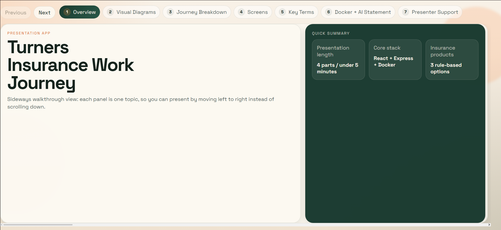
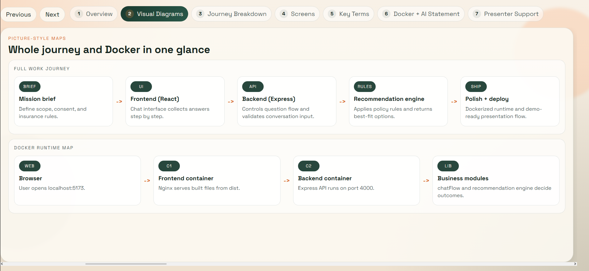
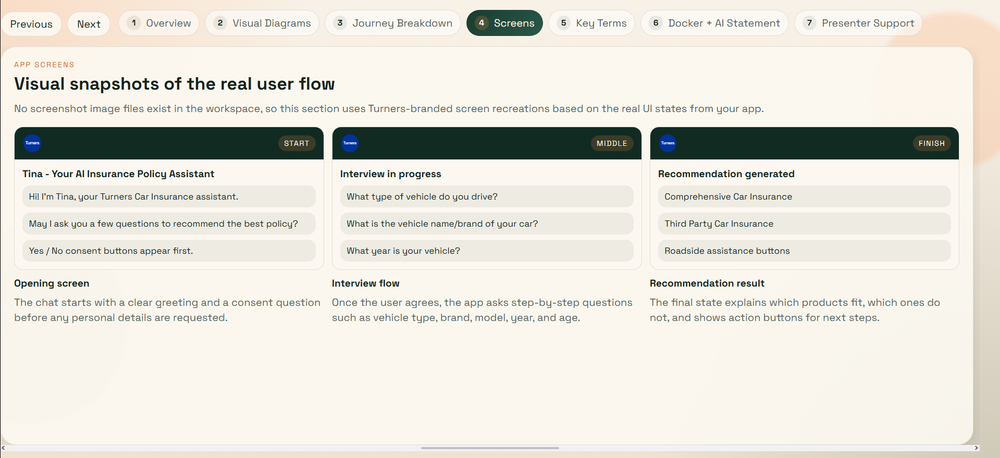
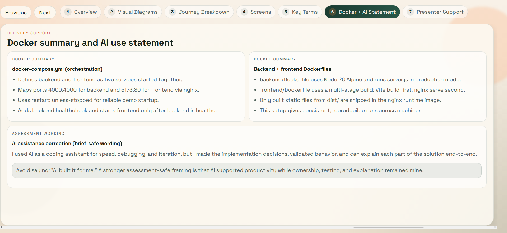

# Mission Ready Portfolio – Zeus Haitana

A curated portfolio of full-stack development projects built across NZQA Level 4 and the Mission Ready programme (Level 5), showcasing my growth into a full-stack developer with experience in frontend, backend, APIs, databases, cloud tooling, and AI-integrated applications.

---

## 👋 About Me

Kia ora, I’m **Zeus Haitana**, an aspiring full-stack developer based in New Zealand.

I build practical web applications with a focus on:

* clean user experiences
* structured backend logic
* real-world problem solving
* AI-assisted features

My work so far has included solo and team-based projects across frontend, backend, databases, deployment, API testing, and developer tooling.

---

## 🛤️ Development Journey

My development journey spans multiple stages of learning and real-world project work:

* 🎓 **NZQA Level 4 – Full-Stack Development (Foundations)**
* 🚀 **Mission Ready Level 5 – Advanced Projects**
* 🎉 **Mission Ready Level 6 - Collaborated Work Experience with CAS (Johannes Dimyadi)**
* 📊 **Mission Ready Postgraduate Micro-creditential AI engineer upcoming?...**
* 🏆 **Mission Ready Masters Degree in Full Stack Development upcoming goal**

This portfolio reflects a progression from foundational projects to more complex full-stack systems.

Due to personal circumstances, my Level 5 journey was temporarily postponed. I returned to complete it while continuing to strengthen my skills, demonstrating resilience, adaptability, and consistency in my development path.

Because of that journey, some repositories reflect different stages of my growth across Level 4, Level 5, and future Level 6 work. That means there is a mix of project structure, complexity, and technologies across this portfolio — which reflects my full-stack learning journey over time.

---

## 🚀 Featured Work

### 🧠 Turners Insurance Policy Advisor *(Featured Project)*

A full-stack chatbot-style application designed to help users understand and choose car insurance policies.

**Key Contributions**

* Built chatbot-style frontend interaction
* Developed recommendation logic
* Connected frontend with backend systems
* Iterated through debugging and improvements

**Includes**

* Full-stack architecture
* AI-style decision logic
* Database-backed workflows
* Docker deployment
* Interactive showcase app explaining the system

> 🔒 Code partially restricted due to organisation ownership
> 📄 Fully documented in this portfolio

## 📸 Project Screenshots

### 🧠 Turners Insurance Policy Advisor

**Overview of the application and core stack**

---

**Full system workflow (frontend → backend → recommendation engine → deployment)**

---

**Chatbot interaction and recommendation flow**

---

**Docker configuration and deployment setup**

---

### 🎤 Work Journey Showcase

An interactive presentation application created to communicate the full development process behind the Turners project.

**Highlights**

* Explains system architecture and workflows
* Demonstrates debugging and iteration journey
* Designed for stakeholder and technical presentations

---

## 🧩 Mission Ready Projects

### 🚀 Level 5 – Advanced Development

#### 👤 Solo Projects

* **Mission 0**
  Foundations of project setup and development
  🔗 https://github.com/MR-2026-FT-Feb-L5ADV/mission-0-13eppo

* **Mission 1**
  Structured frontend/backend workflows
  🔗 https://github.com/MR-2026-FT-Feb-L5ADV/mission-1-13eppo

* **Mission 5 (Phase 1)**
  Individual full-stack implementation
  🔗 https://github.com/MR-2026-FT-Feb-L5ADV/mission-5-phase-1-individual-13eppo

#### 👥 Team Projects

* **Mission 2 (Team Project)**
  Collaborative frontend + backend integration
  🔗 https://github.com/MR-2026-FT-Feb-L5ADV/mission-2-t4-paywand-turei-zeus-idk-yet

* **Mission 3 (Team Project)**
  Expanded system development in a team environment
  🔗 https://github.com/MR-2026-FT-Feb-L5ADV/mission-3-t4-paywand-turei-zeus-idk-yet

* **Mission 5 (Phase 2 – Team)**
  Advanced collaborative full-stack project
  🔗 https://github.com/MR-2026-FT-Feb-L5ADV/mission-5-phase-2-t2-adrian-katrina-eleanor-zeus

---

### 🎓 Level 4 – Foundations

#### 👥 Team Projects

* **Mission X Frontend**
  🔗 https://github.com/Mission-Ready/2507-L4FT19-missionx-frontend-t3

* **Mission X Backend**
  🔗 https://github.com/Mission-Ready/2507-L4FT19-missionx-backend-t3

---

## 🧠 What These Projects Demonstrate

* Progression from beginner to full-stack developer
* Experience working both independently and in teams
* Understanding of frontend and backend separation
* Building and consuming APIs
* Working with different database systems
* Ability to contribute to larger collaborative systems
* Growth in debugging, structure, testing, and development practices

---

## 🛠️ Tech Stack

### Frontend

* HTML
* CSS
* JavaScript
* JSX
* Component-based UI development

### Backend

* Node.js
* Express

### Databases

* MongoDB
* MySQL

### API & Testing Tools

* Postman

### Cloud & Deployment Tools

* Docker
* Google Cloud SDK

### Developer Tools & Workflow

* Git
* GitHub
* Terminal / command-line workflow
* npm
* Local development environments
* Debugging and iterative development practices

### 📌 Notes on Technologies

The technologies listed above were used across different projects throughout my development journey.

Not every project includes all tools listed — instead, they reflect my **combined experience across frontend, backend, databases, API testing, and deployment workflows**.

This demonstrates my ability to:

* adapt to different tech stacks
* learn and apply new tools quickly
* work across multiple layers of a full-stack system

---

## 🧠 Key Skills Demonstrated

* Full-stack application development
* Designing user-focused interfaces
* Structuring backend logic and APIs
* Database integration using SQL and NoSQL tools
* API testing and endpoint validation
* Working effectively in team environments
* Using containerization and cloud-related tooling
* Debugging and iterative improvement
* Communicating technical concepts clearly

---

## 📌 Repository Context

Many of the projects listed are part of the Mission Ready programme and may:

* be hosted under organisation repositories
* contain team contributions
* have restricted public access

This portfolio focuses on clearly presenting:

* my contributions
* system design understanding
* development process
* technologies and tools used throughout my journey

---

## 🎯 What I’m Working Towards

* Building more production-ready applications
* Strengthening backend and system architecture
* Expanding AI integration skills
* Improving cloud and deployment knowledge
* Creating polished, job-ready portfolio projects

---

## 🤝 Let’s Connect

* 🔗 [LinkedIn](https://www.linkedin.com/in/zeus-haitana-4a22293bb)

---
